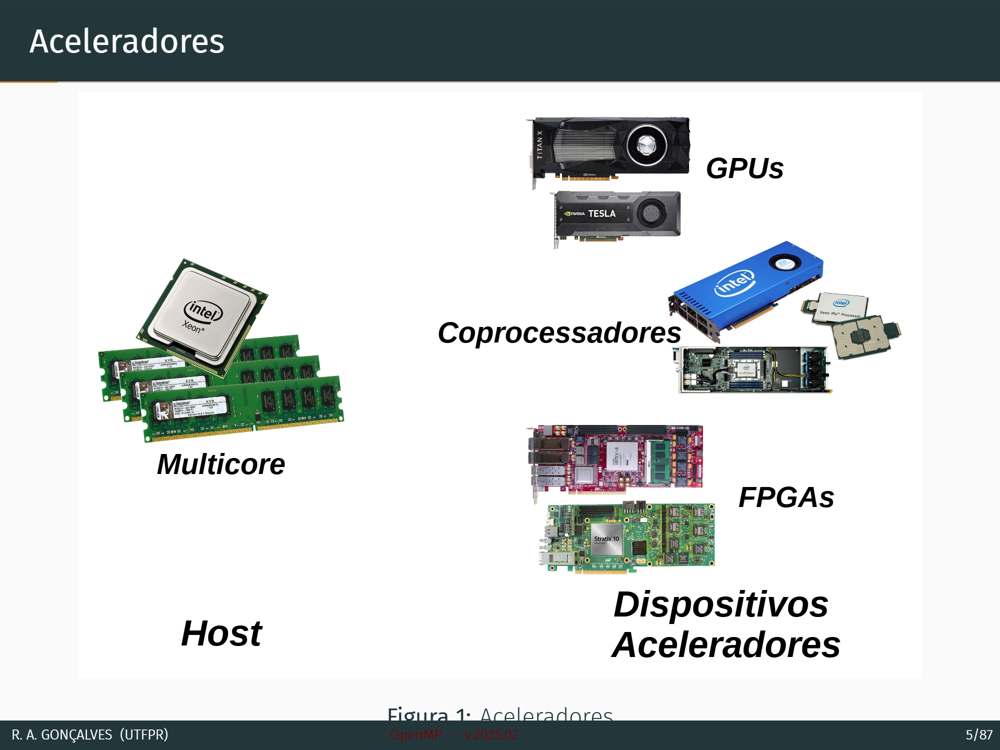
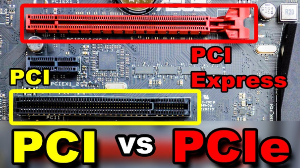
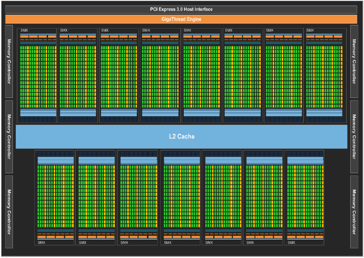
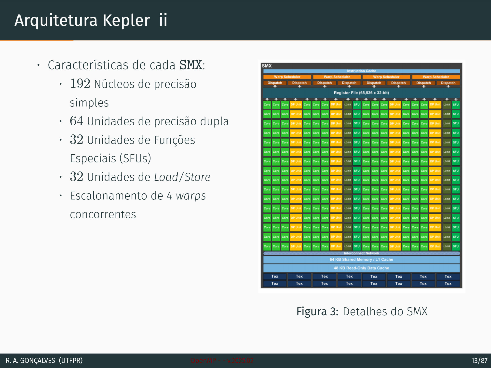
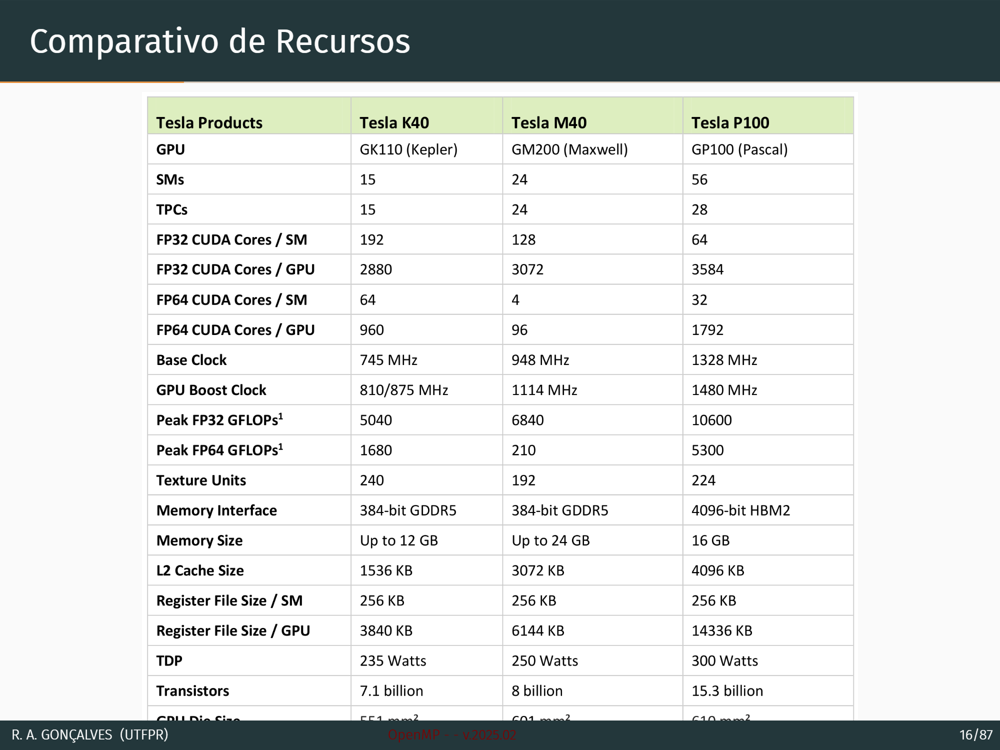
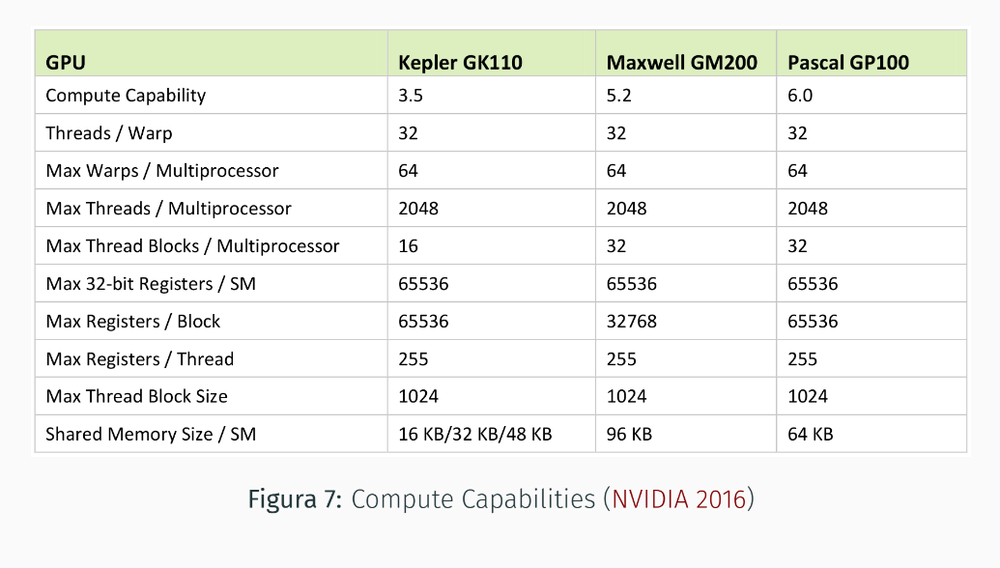
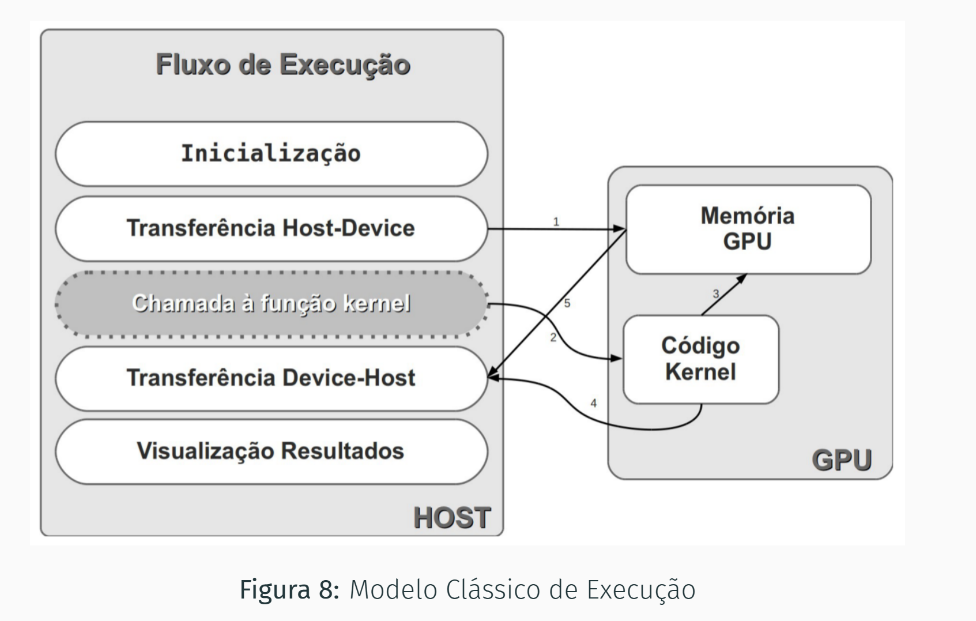
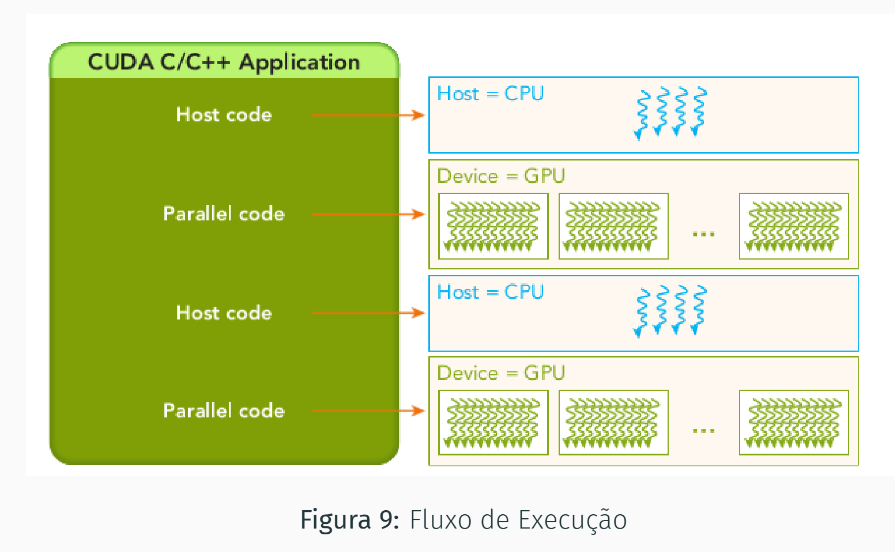

# Computação Paralela e Sistemas Heterogêneos
- *Estudar mecanismos e técnicas para a execução paralela de código e aplicações.*

## Paralelismo x Concorrência
- **Software**
    - Threads
- **Hardware**
    - *Multicore*

## Sistemas Heterogêneos
- Plataformas que possuem elementos de processamento diferentes.
-  ***CPUs*** *multicore* no host + dispositivos aceleradores.
### Dispositivos Aceleradores
- **GPUs**.
- Arranjos de Coprocessadores: **Xeon Phi**.
- Computação Reconfigurável: **FGPAs**.
    - Circuitos que podem reconfigurados pelos clientes, diferente dos *pré-programados*.

## Modelos de Computação

###  Classificação de Flynn Flynn

- **SISD (Single Instruction, Single Data)**: Remete ao modelo de *von Neumann*, representa um único fluxo de instrução e um único fluxo de dados, sem nenhum paralelismo.
- **SIMD (Single Instruction, Multiple Data)**: Um fluxo de instrução executado por máquinas paralelas considerando fluxos de dados distintos.
- **MIMD (Multiple Instruction, Multiple Data)**: Máquinas paralelas que executam fluxo de instrução distintos e separados. Pode ter programas diferentes que processam entradas diferentes -> múltiplos fluxos de dados.
- **SPMD (Single Program, Multiple Data)**: Mais geral que o SIMD, usa aplicações com paralelismo de dados e paralelismo de threads.
- **MSPMD (Multiple SPMD)**: Máquinas que possuem memória global (ilimitada) e *P* processadores SIMD independentes.
- **SIMT (Single Instruction, Multiple Threads)**: Modelo que gerencia o uso de múltiplas *threads* na arquitetura, onde todas as *threads* executam a mesma instrução. Usado pela *NVIDIA* com a plataforma *CUDA*.

## Arquitetura de GPUs
- *NVIDIA* e *AMD* são as maiores fabricantes de GPUs.
    - Atuam em conjunto com CPUs *Intel* e *AMD*.
    - Conectadas no barramento *PCI Express*.

    
- ***SIMD*** ou ***SIMT*** (NVIDIA).
- Funcionam como aceleradores, executando as funções *kernel* enviadas pela CPU.
    - Para a execução de um *kernel* é criado um arranjo de threads aonde cada uma executa uma cópia do código da função do kernel.
- Elas tem sua própria memória em uma hierarquia: Memória Global, Memória Compartilhada 

### Arquitetura Kepler 

- Até 15 *Straming Multiprocessors* (SMX), cada um com 192 núcleos.
    - chega a 2880 cores.
- Introduziu o **paralelismo dinâmico**.
- Execução de kernels simultâneos com ***Hyper-q***.

### Arquitetura Pascal

- **60 SMs** com 64 cores cada -> Total de 3840 cores.
- 16GB de RAM.
- Se comunica com a CPU pelo *NVIDIA NVLink*.

### Comparativo de Recursos

#### Compute Capabilities
- Número de Registradores
- Quantidade de Memória (Global, Textura, ...)
- Quantidade de Cores por SM
- Paralelismo Máximo

### Recuperando Informações do Dispositivo
- *deviceQuery*
- Aplicação exemplo que acompanha o SDK do *CUDA*.
- Lista as informações dos dispositivos instalados no host.

## Modelo de Programação e Execução

### Modelo de Programação CUDA
- Permite utilizar a GPU para computação de propósito geral (GPGPU).
- O CUDA C/C++ é uma extensão para C/C++ que permite a programação para dispositivos heterogêneos.
- **API** para gerenciamento de dispositivos, memória,  transferências entre o *host* e o *device*.
- ***host***: CPU e sua memória principal (Host Memory).
- ***device***: GPU e sua memória global (Device Memory).

#### Modelo clássico de execução

